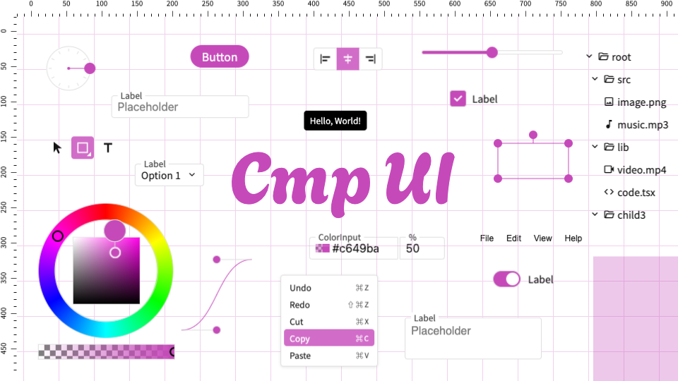

# Cmp UI



**This project is still in the early stage of development.**

CmpUI is a component library designed for creating complex GUI applications in web browsers.

- [Docs](https://toshusai.github.io/cmpui/iframe.html?args=&id=readme--documentation&viewMode=docs)

- [Demo project](https://toshusai.github.io/yeti) / [Repository of the demo](https://github.com/toshusai/yeti)

# Packages

| package name         | framework | NPM                                                                                                                   |
| -------------------- | --------- | --------------------------------------------------------------------------------------------------------------------- |
| @toshusai/cmpui      | React     | [](https://www.npmjs.com/package/@toshusai/cmpui)     |
| @toshusai/cmpui-vue  | Vue       | WIP                                                                                                                   |
| @toshusai/cmpui-core | Vanilla   | WIP                                                                                                                   |

## Installation

```bash
npm install @toshusai/cmpui
```

## Usage

### React

```tsx
import { Button } from "@toshusai/cmpui";
import "@toshusai/cmpui-core/dist/style.css";

export default function App() {
  return <Button>Hello world</Button>;
}
```

## Development

```
pnpm install
```

```
pnpm -r dev
```

```
pnpm -r storybook
```

React: http://localhost:6007/
Vue: http://localhost:6006/

## License

MIT
